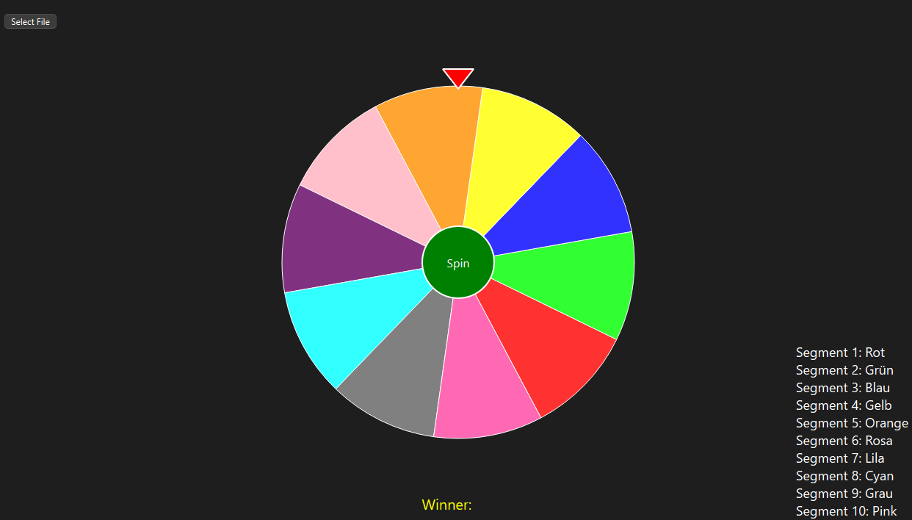

# Randomizer-Wheel

> **RandomWheel** is a visually engaging spinning wheel application built with **Python and PyQt6**. It allows users to load custom entries from a text file and spin the wheel to randomly select a winner. The app features smooth animations, color-coded segments, rollback effects, and a pointer to indicate the result. Perfect for giveaways, games, or decision-making!



**Key Features:**

* 🎨 Dynamic, color-coded wheel segments
* 📂 Load up to 20 items from a `.txt` file
* 🌀 Realistic spin animation with easing and rollback
* 📍 Visual pointer to highlight the winning segment
* 🏷️ Customizable labels and color display

## 📂 File Format

To use your own entries, click the **"Select File"** button and choose a `.txt` file formatted like this:

```text
1
2
3
4
5
6
7
8
9
10
```

Each line represents one entry.  
You can use **up to 20 entries** – any more will be ignored.

## 🌀 How It Works

- The wheel is divided into segments based on your entries.
- Each segment gets a unique color (reused if needed).
- Click **"Spin"** to rotate the wheel and randomly select a winner.
- The selected segment will be shown at the top, with the winner displayed.
